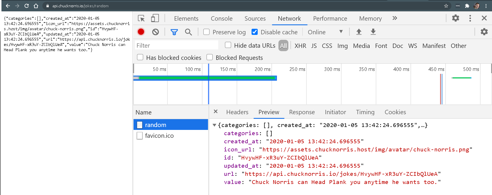

# Chuck Norris strikes back - Trinidad asíncrona

Tenemos acceso a una API tal que, cada vez que la llamamos, nos devuelve un chiste aleatorio sobre Chuck Norris.
Aquí tienes una [Demo](https://js-beginners.github.io/random-joke-api-project/).

Puedes probar simplemente invoncando a la API desde el [navegador](https://api.chucknorris.io/jokes/random)

Fíjate en el formato que devuelve los datos cada vez que la invocas. Para ver mejor la estructura de los datos, puedes inspeccionar las llamadas que hace el script del 
lado cliente al servidor.

## Iteración 1

El programa no funciona. Abre el archivo **app.js** y gestiona correctamente la asincronía de la función asíncrona (2 líneas de código deben ser modificadas)

## Iteración 2

Abre la consola del navegador. Fíjate en el orden de impresión de los mensajes. ¿Porque el mensaje #2 se imprime antes que el mensaje #1?

## Iteración 3

En **index.html** cambia el `<script>` usado por **app_then.js**. Comprueba que el programa vuelve a no funcionar. Los primeros párrafos de esta [documentación](https://javascript.info/promise-chaining#bigger-example-fetch) pueden ayudar a averiguar que está ocurriendo.

Pista: solo hay que mover una instrucción al lugar adecuado.

## Iteración 4

En **index.html** cambia el `<script>` usado por **app_callback.js**. Comprueba que el programa vuelve a no funcionar. Hay un error en 1 línea de código.

**Una vez arreglado**, indica el orden en que se ejecuta cada una de las funciones una vez el usuario hace clic en el botón. El nombre de todas las funciones es:

- gestionarClick
- obtenerChiste
- updateDOM
- sigueTrabajando

Ordena el orden de ejecución cuando el usuario hace __clic__ en el botón.

